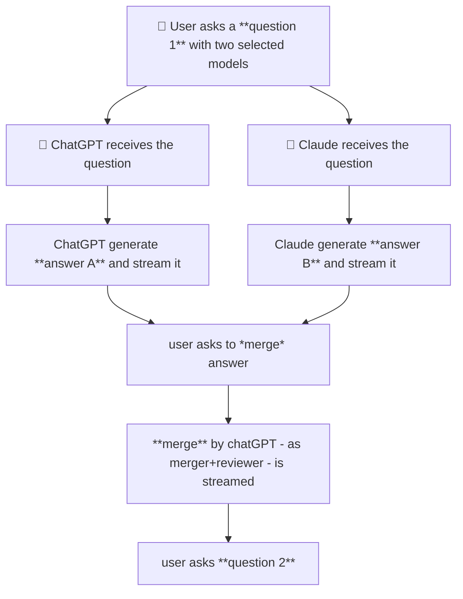
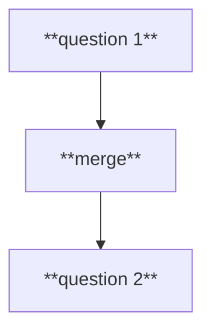

### Workflow 1

```mermaid

graph TD
    A[👤 User asks a **question 1** with two selected models]
    A --> B1[🤖 ChatGPT receives the question]
    A --> B2[🤖 Claude receives the question]

    B1 --> C1[ChatGPT generate **answer A** and stream it]
    B2 --> C2[Claude generate **answer B** and stream it]

    C1 --> D[user asks to *merge* answer]
    C2 --> D

    D --> E[**merge** by chatGPT - as merger+reviewer - is streamed]
    E --> F[user asks **question 2**]

```

when asking for question 2 we feed the llms with the following linearised history

```mermaid

graph TD
    A[**question 1**] --> B[**merge**] --> C[**question 2**]
```